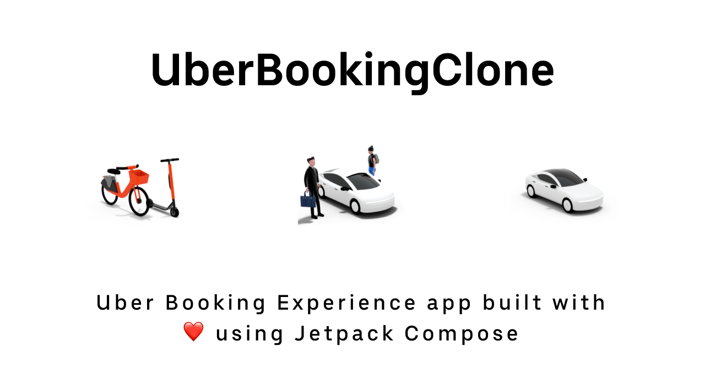

# 🚕 UberBookingClone

 Uber Booking Experience app in Android built using Jetpack compose. 

    
    
    
    
    
    

### 🏁 The purpose of this repository:

- Build a functional Android app to demonstrate Uber booking flow entirely with Kotlin and Jetpack Compose.
- Follows Android design guide and development best practices with Jetpack Compose.
- Explore the possibilities of creating complex ui and ux of a Uber Booking flow using Compose.

### 🛠 Built with ❤️ using Kotlin

| Tools | Link |
|     :---      |          :---: |
| 🤖 Kotlin | [Kotlin](https://kotlinlang.org) |
| 💚 Jetpack Compose | [Jetpack Compose](https://developer.android.com/jetpack/compose) |
| 🌐 Material Design | [Material Design](https://developer.android.com/jetpack/androidx/releases/compose-material) |
| 🌊 Coroutines | [Kotlin Coroutines](https://developer.android.com/kotlin/coroutines) |
| 🗺️ Maps Compose Library | [Maps Compose](https://developers.google.com/maps/documentation/android-sdk/maps-compose) |
| 🧭 Navigating with Compose | [Navigating with Compose](https://developer.android.com/jetpack/compose/navigation) |
| 🎨 Accompanist | [Accompanist](https://google.github.io/accompanist) |

| Pick direction location pin show every time  | 
| ------------- | 
| <video src="https://drive.google.com/file/d/19hUOInJLT5i3MxOd1BwMhZeOiNY-8YEj/view?usp=sharing"  width=250px /> |

### ⚙️ Run a project

- Create new Google map API key by following [steps](https://developers.google.com/maps/documentation/android-sdk/maps-compose#requirements) here and 
add map api key in `local.properties` as `MAPS_API_KEY="[your_api_key]"` and Sync project with gradle file to run it.

### 📷 Screenshots

### Contribute

- If you want to contribute to this library, you're always welcome!
See [Contributing Guidelines](CONTRIBUTING.md).

### :envelope: Get in touch!

### Find this project useful ? ❤️

- Support it by clicking the ⭐️ button on the upper right of this page. ✌️

### License

- See [License](LICENSE)
